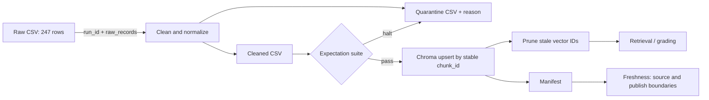

# Kiến trúc pipeline — Lab Day 10

**Nhóm:** Day 10 Data Team
**Cập nhật:** 2026-06-10

---

## 1. Sơ đồ luồng (bắt buộc có 1 diagram: Mermaid / ASCII)

---

## 2. Ranh giới trách nhiệm

| Thành phần | Input | Output | Owner nhóm |
|------------|-------|--------|--------------|
| Ingest | `policy_export_dirty.csv` | 247 row dictionaries + raw count | Ingestion Owner |
| Transform | Raw rows | Cleaned CSV + quarantine CSV | Cleaning Owner |
| Quality | Cleaned rows | 10 expectation results, halt decision | Quality Owner |
| Embed | Valid cleaned CSV | Chroma snapshot, 33 vectors | Embed Owner |
| Monitor | Manifest timestamps | PASS/WARN/FAIL freshness detail | Monitoring Owner |

---

## 3. Idempotency & rerun

`chunk_id` là SHA-256 rút gọn của `doc_id` và nội dung đã normalize. Pipeline dùng
Chroma `upsert`, sau đó prune mọi ID không còn trong snapshot cleaned. Test
`test_chunk_ids_are_stable_across_reruns` xác nhận hai lần clean tạo cùng dãy ID;
run lại `final-good` giữ collection ở 33 vectors, không phát sinh duplicate.

---

## 4. Liên hệ Day 09

Day 10 dùng export riêng nhưng cùng domain tài liệu với Day 09. Collection
`day10_kb` được tách để grading không làm thay đổi collection của multi-agent.
Trong triển khai thật, retrieval worker Day 09 có thể trỏ sang snapshot đã
validate này bằng cách cấu hình cùng Chroma path/collection.

---

## 5. Rủi ro đã biết

- Source export đang stale so với SLA 24 giờ; manifest hiện báo FAIL ở ingest boundary.
- Model embedding nhỏ có thể nhạy với phrasing; eval 21 câu được giữ làm regression gate.
- Pipeline demo publish trực tiếp; production nên dùng staging collection rồi swap alias.
